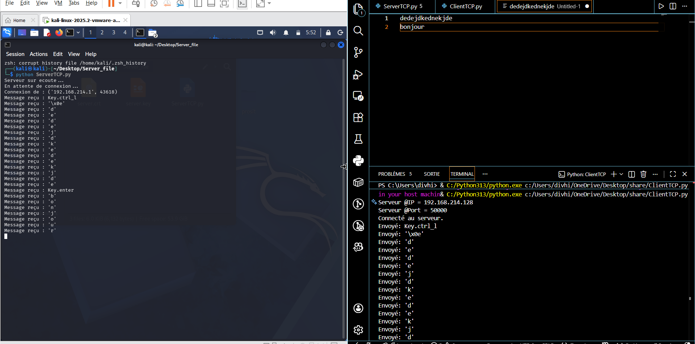

# 🔐  Keylogger_with_TCP_server
Outil de type keylogger qui envoie ces donnée vers un serveur avec un protocole TCP

Ce projet s’inscrit dans une démarche de **sensibilisation à la cybersécurité**.
Il vise à illustrer le fonctionnement de certaines menaces afin de mieux comprendre comment les détecter et s’en protéger.

---

## 🎯 Objectif

* comprendre les mécanismes utilisés par certains logiciels malveillants
* Recuperer des touches ou des frappes clavier et les envoyer vers un serveur distants

---

## 💡 Concept

Ce projet simule un comportement typique observé dans certaines attaques :
la capture d’informations et leur transmission vers un serveur distant.

---

## 📡 Axe d’étude

* communication réseau entre un client et un serveur
* analyse des schémas d’exfiltration de données

---

## 🛡️ Approche

Le projet est utilisé dans un cadre pour :

* illustrer des scénarios réels de menaces
* comprendre comment ces activités peuvent être détectées
* encourager la mise en place de bonnes pratiques de sécurité a travers

---

## ⚙️ Technologies

* PYTHON
---

## ⚠️ Avertissement

Ce projet est strictement destiné à un usage **expérimental**.

---

## 📌 Statut

Projet en expérimentation.

---

## 🔍 Perspective

L’objectif à long terme est de proposer une protocole pour chiffrer les donnees afin qu'il ne puisse pas etre intercepter

## DEMO

